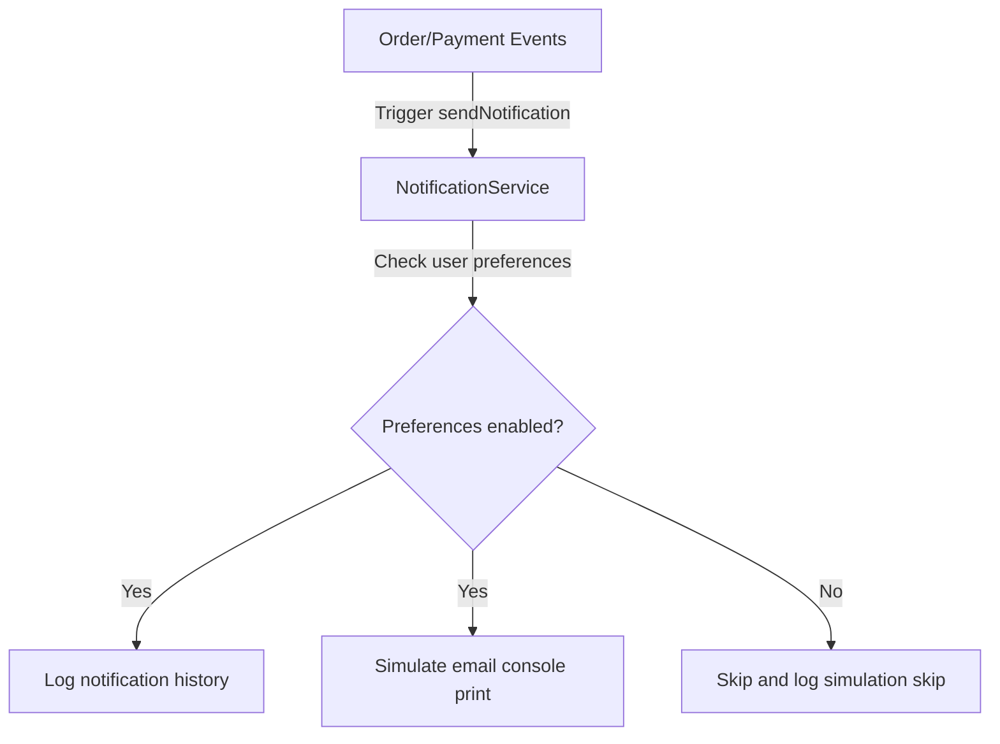

# ARCHITECTURE SNAPSHOT

This file is append-only. Add a new section after each completed phase and do not remove earlier snapshots.

## Phase 1 Snapshot - Foundation API Scaffold

### Current Controllers
- HealthController
- BlueprintController
- StakeholderController

### Current Services
- BlueprintCatalogService
- StakeholderCatalogService

### Current Endpoints
- `GET /api/v1/health`
- `GET /api/v1/blueprint`
- `GET /api/v1/stakeholders`

### Current Data Flow
- HTTP request enters a controller.
- The controller either returns a direct response or delegates to a service.
- The service returns in-memory catalog data.
- The controller serializes the response as JSON.

### Current Package Structure
- `com.laundrylink.laundrylink.api`
- `com.laundrylink.laundrylink.service`

### Current Limitations
- No persistence layer.
- No repository layer.
- No authentication or authorization.
- No user identity or session model.
- No real business mutations yet.

### Future Database Replacement Plan
- Replace in-memory catalog data with repository-backed data.
- Introduce entity classes for persisted reference data where needed.
- Move catalog data out of services and into the database layer.

### Future Authentication Integration Plan
- Add Spring Security after the domain model stabilizes.
- Introduce JWT-based authentication.
- Protect business endpoints once login and user identity are defined.
- Add role-based access control for customers, partners, and admins.

### High-Level Architecture
- Spring Boot application exposes REST endpoints.
- Controllers map HTTP requests to service calls.
- Services currently provide in-memory data.
- Database and security layers are deferred.

### Request Flow Diagram (text format)
- Client -> Controller -> Service -> In-memory data -> JSON response

### API Inventory Table
| Endpoint | Method | Purpose | Future Replacement |
| --- | --- | --- | --- |
| `/api/v1/health` | GET | Returns application health status | Optional Actuator health endpoint |
| `/api/v1/blueprint` | GET | Returns project blueprint metadata | Database-backed catalog or configuration store |
| `/api/v1/stakeholders` | GET | Returns stakeholder roles and capabilities | Persisted role and permission data |

### Service Responsibility Table
| Service | Responsibility | Future Replacement |
| --- | --- | --- |
| `BlueprintCatalogService` | Supplies order lifecycle and service catalog data | Repository-backed catalog service |
| `StakeholderCatalogService` | Supplies stakeholder role definitions and capability lists | Repository-backed role/permission service |

### Future Repository Layer Plan
- Add repository interfaces for catalog and domain data once persistence begins.
- Keep controllers unchanged where possible and move data access into repositories.
- Introduce transactional service methods only when write operations appear.

### Future Entity Design Notes
- `service_category` and `service` entities will likely model the blueprint catalog.
- `roles` and `permissions` entities will likely model stakeholder access.
- `users` may later become the shared root entity for customer, partner, and admin profiles.

## Phase 2 Snapshot - User Management Foundation

### Current Controllers
- HealthController
- BlueprintController
- StakeholderController
- UserManagementController

### Current Services
- BlueprintCatalogService
- StakeholderCatalogService
- UserManagementService

### Current Endpoints
- `GET /api/v1/health`
- `GET /api/v1/blueprint`
- `GET /api/v1/stakeholders`
- `GET /api/v1/users/roles`
- `GET /api/v1/users/profiles`
- `GET /api/v1/users/{role}/profile`
- `GET /api/v1/users/{role}/addresses`

### Current Data Flow
- HTTP request enters a controller.
- The controller delegates to a service for catalog or profile data.
- The service selects data from in-memory maps or lists.
- The controller returns a JSON response.

### Current Package Structure
- `com.laundrylink.laundrylink.api`
- `com.laundrylink.laundrylink.service`

### Current Limitations
- Still no database persistence.
- Still no repository layer.
- Still no authentication or authorization.
- User profiles are sample data, not live accounts.
- Addresses are limited to the read-only customer sample set.

### Future Database Replacement Plan
- Replace `UserManagementService` maps and lists with repository-backed user data.
- Persist addresses in a dedicated address table.
- Replace role summaries with persisted role and permission entities.
- Link user profile data to database identity records.

### Future Authentication Integration Plan
- Add Spring Security for login and request protection.
- Move from sample profile data to authenticated user identity.
- Map JWT claims or security principals to roles such as customer, partner, delivery partner, and admin.
- Enforce access rules for profile and address endpoints.

### High-Level Architecture
- Spring Boot REST API is still the main entry point.
- Controllers remain thin request handlers.
- Services hold the user-management and blueprint catalogs in memory.
- Persistence and authentication are still planned, not implemented.

### Request Flow Diagram (text format)
- Client -> Controller -> Service -> In-memory role/profile/address data -> JSON response

### API Inventory Table
| Endpoint | Method | Purpose | Future Replacement |
| --- | --- | --- | --- |
| `/api/v1/health` | GET | Returns application health status | Optional Actuator health endpoint |
| `/api/v1/blueprint` | GET | Returns project blueprint metadata | Database-backed catalog or configuration store |
| `/api/v1/stakeholders` | GET | Returns stakeholder roles and capabilities | Persisted role and permission data |
| `/api/v1/users/roles` | GET | Returns user role summaries | Persisted roles and permissions |
| `/api/v1/users/profiles` | GET | Returns sample profiles for all roles | Database-backed profile listing |
| `/api/v1/users/{role}/profile` | GET | Returns one role-specific profile | User profile lookup from persisted user data |
| `/api/v1/users/{role}/addresses` | GET | Returns addresses for a selected role | Customer address repository lookup |

### Service Responsibility Table
| Service | Responsibility | Future Replacement |
| --- | --- | --- |
| `BlueprintCatalogService` | Supplies order lifecycle and service catalog data | Repository-backed catalog service |
| `StakeholderCatalogService` | Supplies stakeholder role definitions and capability lists | Repository-backed role/permission service |
| `UserManagementService` | Supplies sample user profiles and addresses | User, role, and address repository service |

### Future Repository Layer Plan
- Introduce `UserRepository` for core identity/profile data.
- Introduce `AddressRepository` for customer addresses.
- Introduce role and permission repositories or a join model for access control.
- Keep service methods as the orchestration layer above the repositories.

### Future Entity Design Notes
- `users` should likely become the central entity for identity.
- `customer`, `laundry_partner`, `delivery_partner`, and `admin` may become subtype or profile tables depending on the chosen inheritance strategy.
- `address` should belong to customer identity records.
- `roles` and `permissions` should support future security integration.
- The current `UserRoleType` enum is a useful temporary contract, but it may be replaced or mapped to persisted role records later.

## Phase 3 Snapshot - Authentication and Security

### Current Controllers
- HealthController
- BlueprintController
- StakeholderController
- UserManagementController
- AuthController

### Current Services
- BlueprintCatalogService
- StakeholderCatalogService
- UserManagementService
- AuthService
- JwtService

### Current Endpoints
- `GET /api/v1/health`
- `GET /api/v1/blueprint`
- `GET /api/v1/stakeholders`
- `GET /api/v1/users/roles`
- `GET /api/v1/users/profiles`
- `GET /api/v1/users/{role}/profile`
- `GET /api/v1/users/{role}/addresses`
- `POST /api/v1/auth/register`
- `POST /api/v1/auth/login`

### Current Data Flow
- Public requests hit public controllers and return catalog data directly from services.
- Registration requests create an in-memory account with BCrypt-hashed password.
- Login requests validate the stored password hash and generate a JWT.
- Protected requests carry a bearer token.
- The JWT filter validates the token and populates the Spring Security context.
- Method-level security checks role access before controller methods execute.

### Current Package Structure
- `com.laundrylink.laundrylink.api`
- `com.laundrylink.laundrylink.service`
- `com.laundrylink.laundrylink.security`

### Current Limitations
- Still no persistence layer.
- Still no repository layer.
- Accounts live only in memory.
- JWT secret is a development-only constant.
- Passwords and tokens reset on application restart.

### Future Database Replacement Plan
- Replace in-memory auth accounts with a `users` table.
- Replace seeded role-based accounts with persisted identity records.
- Replace address and profile lookups with repositories.
- Persist role assignments and access rules in dedicated tables.
- Move JWT subject data to database-backed identity lookups when needed.

### Future Authentication Integration Plan
- Keep JWT as the stateless auth mechanism.
- Move the JWT signing secret to configuration or a secret store.
- Replace in-memory registration with repository-backed account creation.
- Enforce permissions with persistent roles and authorities.
- Map authenticated principals to database users instead of sample records.

### High-Level Architecture
- Spring Boot REST API handles requests.
- Spring Security filters authenticate bearer tokens.
- Controllers remain thin and delegate to services.
- Services manage catalog data and in-memory auth accounts.
- JWT acts as the stateless identity carrier.

### Request Flow Diagram (text format)
- Client -> Auth Controller -> Auth Service -> Password Encoder -> JWT Service -> JSON response
- Client -> Protected Controller -> JWT Filter -> Security Context -> Service -> JSON response

### API Inventory Table
| Endpoint | Method | Purpose | Future Replacement |
| --- | --- | --- | --- |
| `/api/v1/health` | GET | Returns application health status | Optional Actuator health endpoint |
| `/api/v1/blueprint` | GET | Returns project blueprint metadata | Database-backed catalog or configuration store |
| `/api/v1/stakeholders` | GET | Returns stakeholder roles and capabilities | Persisted role and permission data |
| `/api/v1/users/roles` | GET | Returns user role summaries | Persisted roles and permissions |
| `/api/v1/users/profiles` | GET | Returns sample profiles for all roles | Database-backed profile listing |
| `/api/v1/users/{role}/profile` | GET | Returns one role-specific profile | User profile lookup from persisted user data |
| `/api/v1/users/{role}/addresses` | GET | Returns addresses for a selected role | Customer address repository lookup |
| `/api/v1/auth/register` | POST | Registers a new account and returns a JWT | Persisted account creation flow |
| `/api/v1/auth/login` | POST | Authenticates credentials and returns a JWT | Repository-backed authentication flow |

### Service Responsibility Table
| Service | Responsibility | Future Replacement |
| --- | --- | --- |
| `BlueprintCatalogService` | Supplies order lifecycle and service catalog data | Repository-backed catalog service |
| `StakeholderCatalogService` | Supplies stakeholder role definitions and capability lists | Repository-backed role/permission service |
| `UserManagementService` | Supplies sample user profiles and addresses | User, role, and address repository service |
| `AuthService` | Registers accounts, authenticates logins, and issues JWTs | Repository-backed authentication service |
| `JwtService` | Generates and validates signed bearer tokens | Secret-management-backed JWT service |

### Future Repository Layer Plan
- Introduce `UserRepository` for core identity/profile data.
- Introduce `AddressRepository` for customer addresses.
- Introduce role and permission repositories or a join model for access control.
- Add an account repository for authentication credentials.
- Keep service methods as the orchestration layer above the repositories.

### Future Entity Design Notes
- `users` should likely become the central entity for identity.
- `customer`, `laundry_partner`, `delivery_partner`, and `admin` may become subtype or profile tables depending on the chosen inheritance strategy.
- `address` should belong to customer identity records.
- `roles` and `permissions` should support future security integration.
- `auth_accounts` or a similar credential table may be needed if login remains separate from profile data.
- The current `UserRoleType` enum is a useful temporary contract, but it may be replaced or mapped to persisted role records later.

## Phase 4 Snapshot - Laundry Partner Management

### Current Controllers
- HealthController
- BlueprintController
- StakeholderController
- UserManagementController
- AuthController
- LaundryPartnerController

### Current Services
- BlueprintCatalogService
- StakeholderCatalogService
- UserManagementService
- AuthService
- JwtService
- LaundryPartnerService

### Current Endpoints
- `GET /api/v1/health`
- `GET /api/v1/blueprint`
- `GET /api/v1/stakeholders`
- `GET /api/v1/users/roles`
- `GET /api/v1/users/profiles`
- `GET /api/v1/users/{role}/profile`
- `GET /api/v1/users/{role}/addresses`
- `POST /api/v1/auth/register`
- `POST /api/v1/auth/login`
- `GET /api/v1/partners/profile`
- `PUT /api/v1/partners/profile`
- `GET /api/v1/partners/{email}/profile`
- `GET /api/v1/partners/service-areas`
- `PUT /api/v1/partners/service-areas`
- `GET /api/v1/partners/{email}/service-areas`
- `GET /api/v1/partners/availability`
- `PUT /api/v1/partners/availability`
- `GET /api/v1/partners/{email}/availability`
- `GET /api/v1/partners/documents`
- `POST /api/v1/partners/documents`
- `PUT /api/v1/partners/{email}/documents/{documentId}/verify`
- `GET /api/v1/partners/pricing`
- `PUT /api/v1/partners/pricing`
- `GET /api/v1/partners/{email}/pricing`

### Current Data Flow
- Public or role-authenticated requests enter `LaundryPartnerController`.
- The controller retrieves the caller's JWT security principal.
- The controller checks role privileges (e.g. ensuring only own partner can write data, or only admins can verify documents).
- The controller calls `LaundryPartnerService` which maps requests to the in-memory `PartnerProfile` state.
- Response payloads are serialized back as JSON DTOs.

### Current Package Structure
- `com.laundrylink.laundrylink.api`
- `com.laundrylink.laundrylink.service`
- `com.laundrylink.laundrylink.security`

### Current Limitations
- Still no database persistence; all data resets on application restart.
- Documents are represented as base64 strings in memory.

### Future Database Replacement Plan
- Map `PartnerProfile` to a persisted entity with one-to-many relationships for service areas, availability slots, documents, and rate card items.
- Replace in-memory lookup maps with repository-backed queries.

## Phase 5 Snapshot - Order Management Core

### Current Controllers
- HealthController
- BlueprintController
- StakeholderController
- UserManagementController
- AuthController
- LaundryPartnerController
- OrderController

### Current Services
- BlueprintCatalogService
- StakeholderCatalogService
- UserManagementService
- AuthService
- JwtService
- LaundryPartnerService
- OrderService

### Current Endpoints
- All endpoints from previous phases.
- `POST /api/v1/orders` (CUSTOMER) - places an order.
- `GET /api/v1/orders/{orderId}` (All, checks owner) - gets order details.
- `GET /api/v1/orders/history` (All) - gets order history.
- `PUT /api/v1/orders/{orderId}/status` (All) - updates order status.
- `PUT /api/v1/orders/{orderId}/assign-delivery` (ADMIN/DELIVERY_PARTNER) - assigns delivery.

### Current Data Flow
- Customer requests order placement via `OrderController`.
- `OrderService` checks pricing on `LaundryPartnerService`'s in-memory rate card and calculates total cost.
- Order is stored in memory and transition is logged.
- Security credentials gate status transitions based on user roles (Customer, Laundry Partner, Delivery Partner, Admin).

### Current Limitations
- Still no database persistence; all data resets on application restart.

### Future Database Replacement Plan
- Map `Order` to a database entity.
- Map the list of items to a one-to-many child table.
- Map the history transitions to a one-to-many log table.
- Replace in-memory ConcurrentHashMap with database repository methods (`findByCustomerEmail`, `findByPartnerEmail`, etc.).

## Phase 6 Snapshot - Delivery Management

### Current Controllers
- HealthController
- BlueprintController
- StakeholderController
- UserManagementController
- AuthController
- LaundryPartnerController
- OrderController
- DeliveryController

### Current Services
- BlueprintCatalogService
- StakeholderCatalogService
- UserManagementService
- AuthService
- JwtService
- LaundryPartnerService
- OrderService

### Current Endpoints
- All endpoints from previous phases.
- `GET /api/v1/deliveries/dashboard` (DELIVERY_PARTNER/ADMIN) - gets delivery dashboard lists.
- `GET /api/v1/deliveries/{orderId}/tracking` (Authorized participants) - tracks order status timeline.

### Current Data Flow
- Delivery partners request dashboard and tracking data.
- `DeliveryController` verifies authentication.
- `OrderService` filters orders from memory based on status:
  - `pendingPickups`: status is `ACCEPTED`
  - `pendingDeliveries`: status is `READY_FOR_DELIVERY`
  - `assignedTasks`: delivery email matches caller and status is `PICKUP_ASSIGNED`, `PICKED_UP`, or `DELIVERY_ASSIGNED`

### Current Limitations
- Still no database persistence; all data resets on application restart.

### Future Database Replacement Plan
- Store delivery partner mappings and assignments in database tables.
- Use query-level filters for dashboard retrieval.

## Phase 7 Snapshot - Payment Module

### Current Controllers
- All controllers from previous phases.
- PaymentController

### Current Services
- All services from previous phases.
- PaymentService
- SimulatedPaymentProcessor (implements PaymentProcessor)

### Current Endpoints
- All endpoints from previous phases.
- `POST /api/v1/payments/initiate` (CUSTOMER) - initiates a payment.
- `POST /api/v1/payments/{paymentId}/process` (CUSTOMER) - simulates payment processing.
- `POST /api/v1/payments/{paymentId}/refund` (ADMIN) - refunds payment and cancels invoice.
- `GET /api/v1/payments/{paymentId}` (Authorized participants) - gets payment details.
- `GET /api/v1/payments/orders/{orderId}/invoice` (Authorized participants) - gets order invoice.

### Current Data Flow
- Customer initiates payment for an order.
- `PaymentService` verifies order ownership and total cost via `OrderService`.
- `PaymentProcessor` generates simulated gateway order transactions.
- Payment is created in `PENDING` status.
- Once processed with success, status updates to `SUCCESS` and an `Invoice` with status `GENERATED` is created.
- For COD orders, status remains `PENDING` until delivery completion, where `completeCodPayment` updates status to `SUCCESS` and generates the invoice.
- Admin refund transitions payment to `REFUNDED` and linked invoice to `CANCELLED`.

### Pluggable Payment Integration Strategy
- The interface `PaymentProcessor` abstracts gateway-specific order and checkout generation.
- To swap simulation with real Razorpay, implement `RazorpayPaymentProcessor` using Razorpay's Java SDK and inject it without changing the controller or service logic.

### Future Database Replacement Plan
- Map `Payment` and `Invoice` to database tables.
- Use database transactions to guarantee atomic updates between order delivery state changes and payment completions.

## Phase 8 Snapshot - Review & Rating Module

### Current Controllers
- All controllers from previous phases.
- ReviewController

### Current Services
- All services from previous phases.
- ReviewService

### Current Endpoints
- All endpoints from previous phases.
- `POST /api/v1/reviews` (CUSTOMER only) - submits a review for a delivered order.
- `GET /api/v1/reviews/history` (CUSTOMER only) - views customer review history.
- `GET /api/v1/reviews/partners/{partnerEmail}` (All Authenticated) - views partner reviews and summary.
- `GET /api/v1/reviews/{reviewId}` (Authorized participants) - views specific review details.

### Current Data Flow
- Customer submits a review for an order.
- `ReviewService` verifies the order is delivered, belongs to the caller, has not been reviewed yet, and has a rating between 1 and 5 stars.
- Review is stored in memory.
- `ReviewService` automatically aggregates all ratings for the partner, updates the individual star counts (1★ to 5★), calculates the average rating, and updates the `reputationScore` and `totalReviews` on the partner profile in `LaundryPartnerService`.
- If another user (like Customer B) tries to fetch Customer A's review details, access is rejected with `403 Forbidden`.

### Future Database Replacement Plan
- Map `Review` to a database entity.
- Calculate reputation scores asynchronously using database aggregation queries or event listeners (e.g. `@PostPersist` on Review entity) to avoid write contention on partner profile rows.

## Phase 9 Snapshot - Notification Module

### Current Controllers
- All controllers from previous phases.
- NotificationController

### Current Services
- All services from previous phases.
- NotificationService

### Current Endpoints
- All endpoints from previous phases.
- `GET /api/v1/notifications/history` (All Authenticated) - retrieves caller's notification history and summary analytics.
- `PUT /api/v1/notifications/history/{notificationId}/read` (All Authenticated) - marks a specific notification as read.
- `GET /api/v1/notifications/preferences` (All Authenticated) - retrieves caller's notification toggles.
- `PUT /api/v1/notifications/preferences` (All Authenticated) - updates caller's notification toggles.

### Notification Architecture & Data Flow
- Centralized `NotificationService` handles creating and storing `Notification` records and checking user configuration preferences.
- Services like `OrderService` and `PaymentService` act as the event source, invoking `NotificationService.sendNotification` during key transitions.
- Client queries are sent to `NotificationController` which validates caller identity and delegates history retrieval or preference adjustment to `NotificationService`.

### Event Trigger Flow

### Preference Management Logic
- Preferences are represented by the `NotificationPreferences` domain object mapping boolean alerts for:
  - `orderStatusAlerts` (default: true)
  - `paymentAlerts` (default: true)
  - `deliveryAlerts` (default: true)
  - `reviewReminders` (default: true)
- During notification sending, the service resolves the corresponding preference field. If it is `false`, dispatching is bypassed and a simulation skip log is generated.

### Notification Ownership Security Validations
- Secure endpoints ensure privacy:
  - Notification history lookup (`GET /api/v1/notifications/history`) uses the caller's email extracted directly from their secure authentication token context.
  - Marking a notification as read (`PUT /api/v1/notifications/history/{notificationId}/read`) validates ownership. If the notification exists but belongs to a different email, a `403 Forbidden` status is returned.
  - Unauthorized tokenless requests are rejected by Spring Security.

### Email Simulation Strategy
- In-place SMTP integration is simulated by generating log statements to the console output:
  - Successful dispatch: `[SIMULATION] Email sent to <email> | Subject: <type> Alert | Message: <message>`
  - Disabled preference: `[SIMULATION] Notification skipped for <email> (Preference disabled) | Type: <type>`

### Future Database Replacement Plan
- Map `Notification` and `NotificationPreferences` to database entities (`notifications` and `notification_preferences` tables).
- Introduce a messaging/event broker (such as Spring Events or RabbitMQ) to decouple business service transitions from notification dispatching, preventing synchronous execution blockages.

## Phase 10 Snapshot - Database & Persistence

### Current Controllers
- All controllers from previous phases.

### Current Services
- All services from previous phases.

### Current Repositories (NEW)
- UserRepository
- PartnerRepository
- OrderRepository
- PaymentRepository
- InvoiceRepository
- ReviewRepository
- NotificationRepository
- NotificationPreferencesRepository

### Database Implementation & Architecture
- Replaced in-memory data structures with MySQL database storage.
- Active tables in schema:
  - `users`: stores customer, partner, rider, and admin account identities.
  - `partners`: stores partner profiles, ratings, timings, SLAs, and capacity parameters.
  - `orders` & `order_status_transitions`: stores order details, items, pricing, and historical transitions.
  - `payments` & `invoices`: stores transactional records, gateway transaction IDs, and invoices.
  - `reviews`: stores customer ratings and comments.
  - `notifications` & `notification_preferences`: stores alerts history and dispatching preferences.
- Standardized audit timelines using `AuditedEntity` `@MappedSuperclass` with automatic `@PrePersist` and `@PreUpdate` timestamp generation.

## Phase 11 Snapshot - Admin Dashboard APIs

### Current Controllers
- AdminController

### Current Services
- AdminService

### Administrative Endpoints
- `GET /api/v1/admin/dashboard` - retrieves summary cards count metrics.
- `GET /api/v1/admin/reports/revenue` - retrieves daily, weekly, monthly, and total revenues.
- `GET /api/v1/admin/analytics/partners` - retrieves laundry partner performance logs.
- `GET /api/v1/admin/users/search` - searches users by email, name, role, and status.
- `DELETE /api/v1/admin/users/{email}` - deletes user and linked partner profile.

### Security Gates
- Gated all `/api/v1/admin/**` endpoints with a strict `.hasRole("ADMIN")` check.

## Phase 12 Snapshot - React Frontend

### Architecture Structure
- Mapped Single Page Application (SPA) using React 19 and Vite.
- Mapped 18 pages across 16 secure routes:
  - Mapped Customer dashboards, order creation wizard, history timeline, billing, and ratings views.
  - Mapped Partner dashboard, document configuration, rates cards, and orders logs.
  - Mapped Rider availability toggles, tasks collection board, and session timers.
  - Mapped Admin reports charts, user directory, partner auditing panels, and invoice systems.
- Handled cross-origin resource sharing (CORS) prevention via local proxy routing in `vite.config.js`.

## Phase 13 Snapshot - Testing & Documentation

### Verification & Testing
- Configured JUnit 5 testing suites with MockMvc mock environments.
- Implemented 46 unit and integration test runs spanning order lifecycles, payments checkout, delivery claims, and notifications.
- Integrated Swagger Web UI support via Springdoc-OpenAPI.

## Phase 14 Snapshot - Smart Laundry Partner Selection & Dynamic Operational Metrics

### Current Entity Fields
- `PartnerEntity`: Added `openingTime`, `closingTime`, `serviceSlaHours`, and `dailyCapacityLimit` columns.

### Timings & SLA Rollover Logic
- India Standard Time (`Asia/Kolkata`) context validation.
- Automatically calculates OPEN/CLOSED status and capacity indicators.
- Rollover calculation: If `remainingWorkingHours < serviceSlaHours`, the SLA commitment target is rolled over to `openingTime` tomorrow + `remainingSlaHours`.

### Checkout Warnings UI
- Enforced a warning notice modal in [PlaceOrderWizard.jsx](frontend/src/components/Customer/PlaceOrderWizard.jsx) preventing checkout advancement on closed or tomorrow-delivery partners until explicitly confirmed by the customer.

## Phase 15 Snapshot - Legacy Slot Selection UI Removal

### Outdated Manual Slot Removal
- Removed the old dropdown selection components for Pickup and Delivery slots from the customer order placement wizard.
- Swapped hardcoded scheduling slots in Step 3 for dynamic, read-only estimated pickup and delivery slots calculated directly using the selected partner's timings and service SLA.
- Standardized the API transaction payloads to send these estimated descriptions to the backend database.

## Phase 16 Snapshot - Smart Automatic Delivery Assignment

### Workload-Balanced Auto-Assignment
- Implemented `autoAssignRider(OrderEntity order)` inside `OrderService.java`.
- Auto-assigns orders in `ACCEPTED` or `READY_FOR_DELIVERY` status to online delivery riders with the lowest active workload, excluding riders who previously rejected the task.

### Daily Rider Rejections policy
- Enforced a hard limit of maximum 2 rejections per day for delivery partners.
- Cancellations and rejections revert the order status and trigger immediate automated re-queuing to other online riders.

## Phase 17 Snapshot - Laundry Partner Cancellation Policy

### Configurable Penalty & Allowance
- Added `cancellationPenaltyPerOrder` (defaults to ₹200.0) field in `PartnerEntity` to let admins configure financial deductions.
- Enforced a monthly allowance of 10 free accepted cancellations for laundry partners.
- History calculations analyze status transition entries chronologically to count cancellations and compute penalties.

### Dashboard Integrations
- Renders warning states (Healthy, Approaching Limit, Allowance Exceeded) and cancellation ledger history inside the Laundry Partner portal.
- Exposes a cancellation penalty configuration input under the Admin compliance directory.

