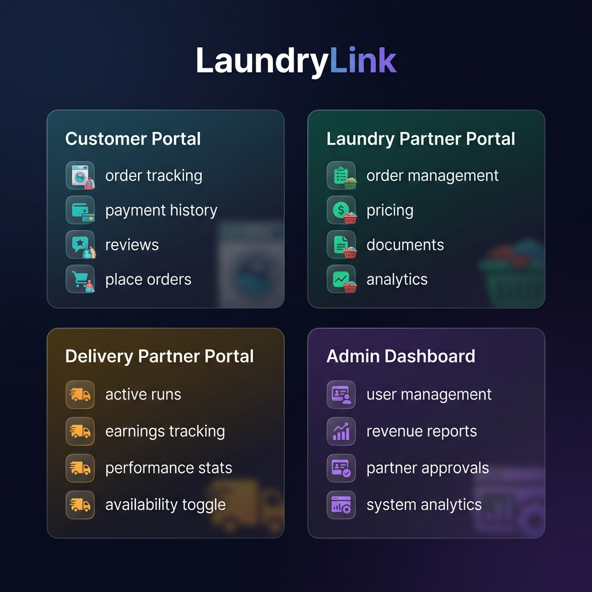
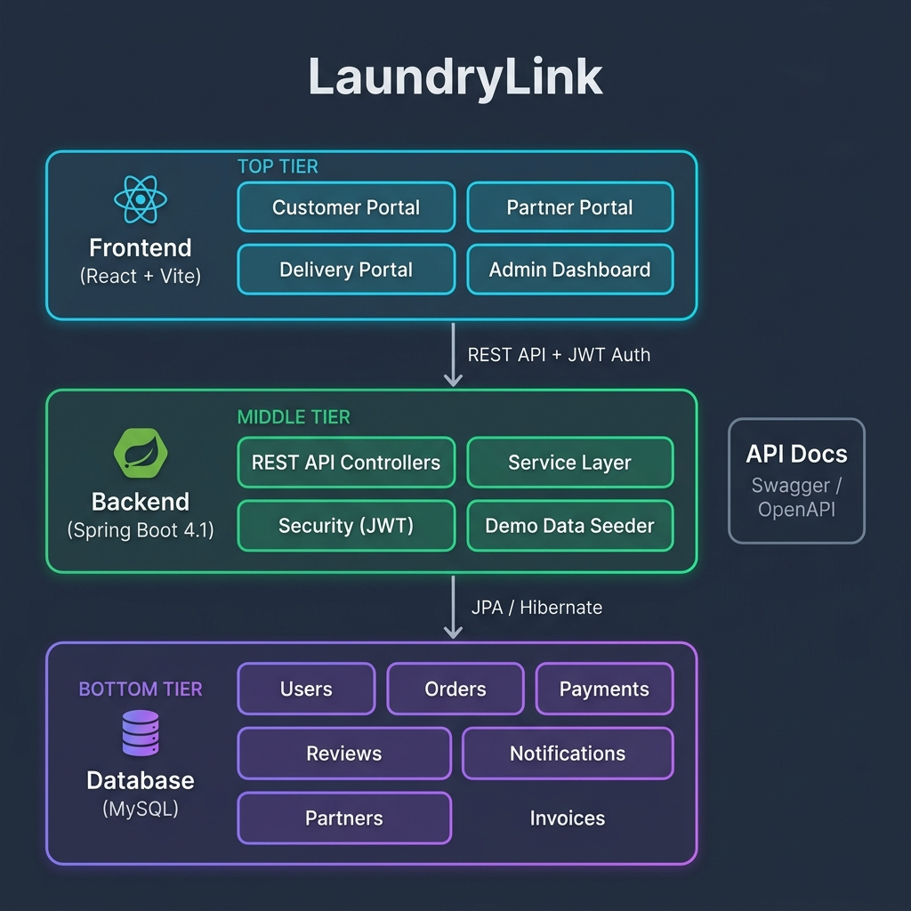
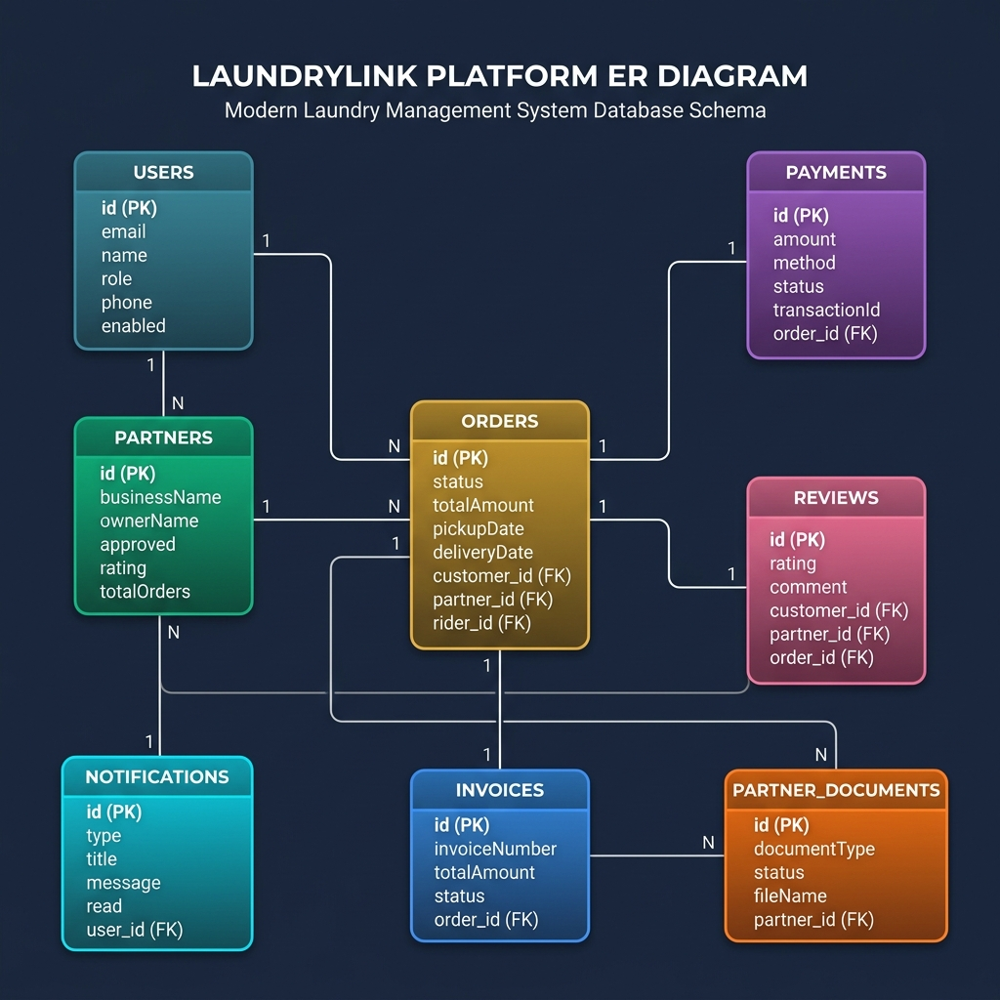
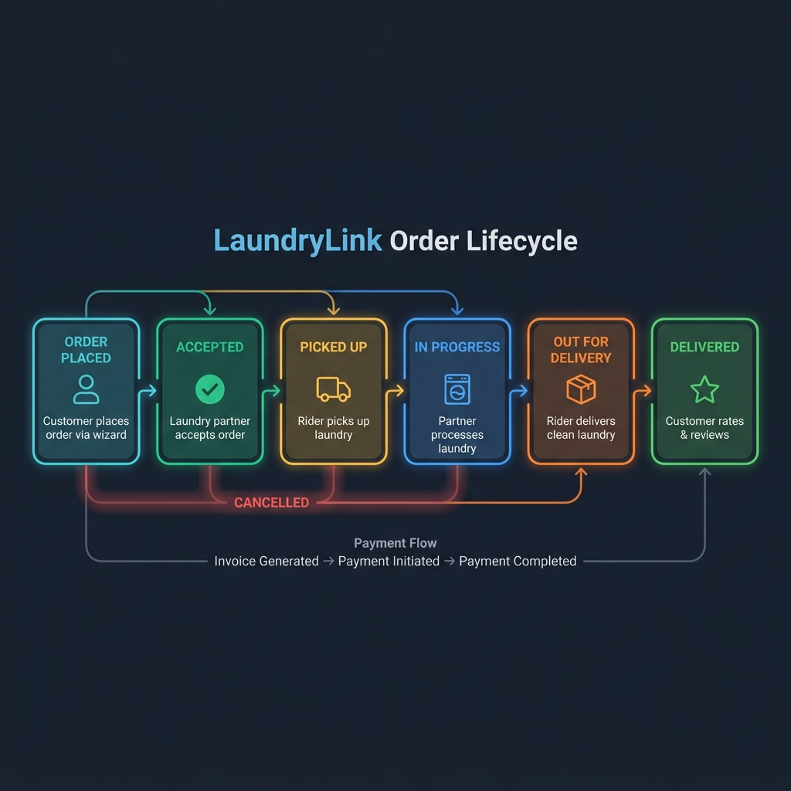

<p align="center">
  
</p>

<h1 align="center">🧺 LaundryLink</h1>

<p align="center">
  <b>A full-stack, multi-role laundry management platform connecting Customers, Laundry Partners, Delivery Riders, and Administrators.</b>
</p>

<p align="center">
  
  
  
  
  
  
</p>

<p align="center">
  <a href="#-features">Features</a> •
  <a href="#-architecture">Architecture</a> •
  <a href="#-project-structure">Project Structure</a> •
  <a href="#-getting-started">Getting Started</a> •
  <a href="#-demo-credentials">Demo Credentials</a> •
  <a href="#-api-documentation">API Docs</a> •
  <a href="#-screenshots">Screenshots</a>
</p>

---

## 📖 Overview

**LaundryLink** is a production-style, full-stack web application that digitizes the entire laundry service lifecycle — from customer order placement to laundry processing, delivery logistics, and administrative oversight.

The platform supports **four distinct user roles**, each with a dedicated dashboard and tailored feature set:

| Role | Description |
|------|-------------|
| 🧑‍💼 **Customer** | Place orders, track laundry status, make payments, submit reviews |
| 🏪 **Laundry Partner** | Manage incoming orders, set pricing, upload documents, track revenue |
| 🚚 **Delivery Partner** | Accept delivery runs, track earnings, manage availability |
| 🛡️ **Admin** | Oversee all users, orders, payments, partners, and platform analytics |

The system ships with a **realistic demo data seeder** that populates 100+ customers, 15–20 laundry partners, 20–30 delivery partners, hundreds of historical orders, and comprehensive payment/review/notification histories — giving the platform the look and feel of a production app that has been operating for months.

---

## ✨ Features

### Customer Portal
- 📦 **Place Orders** — Multi-step wizard with partner selection, item picker, and scheduling
- 📍 **Live Order Tracking** — Real-time status updates across the order lifecycle
- 💳 **Payment Management** — View payment history, receipts, and invoices
- ⭐ **Reviews & Ratings** — Rate laundry partners and leave detailed feedback
- 🔔 **Notifications** — Stay updated on order status changes and promotions

### Laundry Partner Portal
- 📋 **Order Management** — Accept, process, and complete incoming laundry orders
- 💰 **Pricing & Rate Cards** — Define and update service pricing per item category
- 📄 **Document Management** — Upload verification documents with file validation
- 📊 **Performance Analytics** — Revenue trends, order counts, and customer ratings
- ⚙️ **Profile Management** — Update business info, service areas, and operating hours

### Delivery Partner Portal
- 🏃 **Active Runs** — View and manage current delivery assignments
- 📦 **Available Tasks** — Browse available pickup and delivery tasks
- 💵 **Earnings Dashboard** — Track today's, weekly, and monthly earnings
- 🟢 **Availability Toggle** — Go online/offline for accepting deliveries
- 📈 **Performance Stats** — Delivery success rate, total completions, average rating

### Admin Dashboard
- 👥 **User Management** — View, enable/disable, and manage all platform users
- 🏢 **Partner Management** — Approve/reject laundry partners, verify documents
- 📦 **Order Oversight** — Monitor all orders across the platform
- 💳 **Payment Tracking** — Track revenue and payment flows
- 📊 **Analytics & Reports** — Revenue trends, user growth, and platform KPIs

---

## 🏛️ Architecture

<p align="center">
  
</p>

LaundryLink follows a **classic three-tier architecture**:

```
┌─────────────────────────────────────────────────────┐
│                   FRONTEND                          │
│          React 19 + Vite 8 + React Router 7         │
│     Glassmorphic UI · Recharts · Lucide Icons       │
├─────────────────────────────────────────────────────┤
│                 REST API (JSON)                     │
│              JWT Authentication                     │
├─────────────────────────────────────────────────────┤
│                   BACKEND                           │
│           Spring Boot 4.1 · Java 21                 │
│    Spring Security · Spring Data JPA · Swagger      │
├─────────────────────────────────────────────────────┤
│                  DATABASE                           │
│              MySQL 8.x · Hibernate                  │
│   Users · Orders · Payments · Reviews · Invoices    │
└─────────────────────────────────────────────────────┘
```

### Key Design Decisions

| Decision | Rationale |
|----------|-----------|
| **Monorepo** | Single repository for backend + frontend simplifies deployment and versioning |
| **JWT-based Auth** | Stateless authentication suitable for REST APIs with role-based access control |
| **Spring Data JPA** | Reduces boilerplate with repository abstractions; auto DDL via `hibernate.ddl-auto=update` |
| **Vite** | Lightning-fast HMR and build times for modern React development |
| **Demo Data Seeder** | Realistic seeded data makes the platform demo-ready out of the box |
| **OpenAPI / Swagger** | Auto-generated API documentation from controller annotations |

---

## 🗃️ Database Schema

<p align="center">
  
</p>

### Core Entities

| Entity | Description | Key Fields |
|--------|-------------|------------|
| `UserEntity` | All platform users (customers, partners, riders, admins) | email, name, role, phone, enabled |
| `PartnerEntity` | Laundry business profiles | businessName, approved, rating, serviceAreas |
| `OrderEntity` | Laundry service orders | status, totalAmount, pickupDate, deliveryDate |
| `PaymentEntity` | Payment transactions | amount, method, status, transactionId |
| `ReviewEntity` | Customer reviews for partners | rating (1–5), comment, orderId |
| `InvoiceEntity` | Auto-generated order invoices | invoiceNumber, totalAmount, lineItems |
| `NotificationEntity` | In-app notifications | type, title, message, read |
| `PartnerDocumentEntity` | Verification documents | documentType, verificationStatus, fileName |

---

## 🔄 Order Lifecycle

<p align="center">
  
</p>

The order flows through the following statuses:

```
PLACED → ACCEPTED → PICKED_UP → IN_PROGRESS → OUT_FOR_DELIVERY → DELIVERED
  │         │          │
  └─────────┴──────────┴──→ CANCELLED (possible at early stages)
```

Each status transition triggers:
- 🔔 **Notifications** to relevant parties (customer, partner, rider)
- 💰 **Payment processing** at the appropriate stage
- 📄 **Invoice generation** upon order completion
- ⭐ **Review prompt** after delivery

---

## 📁 Project Structure

```
laundrylink/
│
├── 📄 pom.xml                          # Maven project config (Spring Boot 4.1, Java 21)
├── 📄 mvnw / mvnw.cmd                  # Maven wrapper scripts
│
├── 📂 src/                             # ── BACKEND (Spring Boot) ──────────────
│   ├── 📂 main/
│   │   ├── 📂 java/com/laundrylink/laundrylink/
│   │   │   ├── 📄 LaundrylinkApplication.java     # Application entry point
│   │   │   │
│   │   │   ├── 📂 api/                             # REST Controllers & DTOs
│   │   │   │   ├── 📄 AuthController.java          #   POST /api/auth/login, /register
│   │   │   │   ├── 📄 OrderController.java         #   CRUD /api/orders
│   │   │   │   ├── 📄 PaymentController.java       #   Payment processing endpoints
│   │   │   │   ├── 📄 ReviewController.java        #   Customer review endpoints
│   │   │   │   ├── 📄 AdminController.java         #   Admin dashboard & management
│   │   │   │   ├── 📄 LaundryPartnerController.java#   Partner profile, pricing, docs
│   │   │   │   ├── 📄 DeliveryController.java      #   Delivery partner operations
│   │   │   │   ├── 📄 NotificationController.java  #   Notification CRUD
│   │   │   │   ├── 📄 UserManagementController.java#   User profile management
│   │   │   │   ├── 📄 HealthController.java        #   Health check endpoint
│   │   │   │   ├── 📄 BlueprintController.java     #   Service catalog
│   │   │   │   ├── 📄 StakeholderController.java   #   Stakeholder profiles
│   │   │   │   └── 📄 *View.java / *Request.java   #   DTOs (40+ files)
│   │   │   │
│   │   │   ├── 📂 service/                         # Business Logic Layer
│   │   │   │   ├── 📄 AuthService.java             #   Registration, login, JWT
│   │   │   │   ├── 📄 OrderService.java            #   Order lifecycle management
│   │   │   │   ├── 📄 PaymentService.java          #   Payment processing
│   │   │   │   ├── 📄 ReviewService.java           #   Review management
│   │   │   │   ├── 📄 AdminService.java            #   Admin operations
│   │   │   │   ├── 📄 LaundryPartnerService.java   #   Partner management
│   │   │   │   ├── 📄 NotificationService.java     #   Notification handling
│   │   │   │   ├── 📄 UserManagementService.java   #   User CRUD
│   │   │   │   ├── 📄 DemoDataSeeder.java          #   Realistic demo data generator
│   │   │   │   ├── 📄 PaymentProcessor.java        #   Payment processor interface
│   │   │   │   └── 📄 SimulatedPaymentProcessor.java # Mock payment gateway
│   │   │   │
│   │   │   ├── 📂 persistence/                     # Data Access Layer (JPA)
│   │   │   │   ├── 📄 UserEntity.java              #   User table
│   │   │   │   ├── 📄 PartnerEntity.java           #   Partner profiles
│   │   │   │   ├── 📄 OrderEntity.java             #   Orders table
│   │   │   │   ├── 📄 PaymentEntity.java           #   Payments table
│   │   │   │   ├── 📄 ReviewEntity.java            #   Reviews table
│   │   │   │   ├── 📄 InvoiceEntity.java           #   Invoices table
│   │   │   │   ├── 📄 NotificationEntity.java      #   Notifications table
│   │   │   │   ├── 📄 PartnerDocumentEntity.java   #   Document uploads
│   │   │   │   ├── 📄 *Repository.java             #   Spring Data repositories (7)
│   │   │   │   └── 📄 AuditedEntity.java           #   Base entity with timestamps
│   │   │   │
│   │   │   └── 📂 security/                        # Security Layer
│   │   │       ├── 📄 SecurityConfig.java          #   CORS, CSRF, endpoint rules
│   │   │       ├── 📄 JwtService.java              #   JWT token generation/validation
│   │   │       ├── 📄 JwtAuthenticationFilter.java #   Request filter for JWT
│   │   │       └── 📄 AuthenticatedPrincipal.java  #   Custom principal object
│   │   │
│   │   └── 📂 resources/
│   │       └── 📄 application.properties           # DB config, JPA settings
│   │
│   └── 📂 test/java/com/laundrylink/laundrylink/  # ── TESTS ──────────────
│       ├── 📂 api/                                  # Integration Tests
│       │   ├── 📄 AdminDashboardTest.java
│       │   ├── 📄 AuthenticationFlowTest.java
│       │   ├── 📄 DeliveryLifecycleTest.java
│       │   ├── 📄 NotificationTest.java
│       │   ├── 📄 OrderLifecycleTest.java
│       │   ├── 📄 PaymentLifecycleTest.java
│       │   └── 📄 ReviewRatingTest.java
│       └── 📂 service/                              # Unit Tests
│           ├── 📄 AdminServiceTest.java
│           ├── 📄 AuthServiceTest.java
│           ├── 📄 NotificationServiceTest.java
│           ├── 📄 OrderServiceTest.java
│           ├── 📄 PaymentServiceTest.java
│           └── 📄 ReviewServiceTest.java
│
├── 📂 frontend/                        # ── FRONTEND (React + Vite) ───────────
│   ├── 📄 package.json                 # Dependencies & scripts
│   ├── 📄 vite.config.js              # Vite dev server config
│   ├── 📄 index.html                  # HTML entry point
│   ├── 📄 eslint.config.js            # Linting configuration
│   │
│   └── 📂 src/
│       ├── 📄 main.jsx                # React entry point
│       ├── 📄 App.jsx                 # Root component with routing
│       ├── 📄 App.css                 # App-level styles
│       ├── 📄 index.css               # Global design system (CSS variables, glassmorphism)
│       │
│       ├── 📂 components/
│       │   ├── 📂 Auth/               # Authentication
│       │   │   ├── 📄 Login.jsx       #   Login form with role-based redirect
│       │   │   └── 📄 Register.jsx    #   Registration with role selection
│       │   │
│       │   ├── 📂 Common/             # Shared Components
│       │   │   ├── 📄 Navbar.jsx      #   Top navigation bar
│       │   │   ├── 📄 Sidebar.jsx     #   Role-aware sidebar navigation
│       │   │   └── 📄 ProtectedRoute.jsx #  Route guards with role checks
│       │   │
│       │   ├── 📂 Customer/           # Customer Portal
│       │   │   ├── 📄 CustomerDashboard.jsx  #  Dashboard with stats & recent orders
│       │   │   ├── 📄 CustomerOrders.jsx     #  Order history & status tracking
│       │   │   ├── 📄 CustomerPayments.jsx   #  Payment history & receipts
│       │   │   ├── 📄 CustomerReviews.jsx    #  Review history
│       │   │   ├── 📄 PlaceOrderWizard.jsx   #  Multi-step order creation
│       │   │   └── 📄 ReviewModal.jsx        #  Star rating & comment modal
│       │   │
│       │   ├── 📂 Partner/            # Laundry Partner Portal
│       │   │   ├── 📄 PartnerDashboard.jsx   #  Revenue charts & order stats
│       │   │   ├── 📄 PartnerOrders.jsx      #  Incoming & active orders
│       │   │   ├── 📄 PartnerPricing.jsx     #  Rate card management
│       │   │   └── 📄 PartnerDocuments.jsx   #  Document upload & verification
│       │   │
│       │   ├── 📂 Delivery/           # Delivery Partner Portal
│       │   │   ├── 📄 DeliveryDashboard.jsx  #  Earnings, performance, availability
│       │   │   └── 📄 DeliveryTasks.jsx      #  Active runs & available tasks
│       │   │
│       │   ├── 📂 Admin/              # Admin Dashboard
│       │   │   ├── 📄 AdminDashboard.jsx     #  Platform-wide analytics
│       │   │   ├── 📄 AdminOrders.jsx        #  All orders management
│       │   │   ├── 📄 AdminPartners.jsx      #  Partner approval & management
│       │   │   ├── 📄 AdminPayments.jsx      #  Revenue & payment tracking
│       │   │   ├── 📄 AdminReports.jsx       #  Reports & analytics
│       │   │   └── 📄 AdminUsers.jsx         #  User management
│       │   │
│       │   └── 📂 Notifications/      # Notification System
│       │       └── 📄 NotificationCenter.jsx #  In-app notification bell
│       │
│       ├── 📂 context/
│       │   └── 📄 AuthContext.jsx      # Global auth state (JWT, user, role)
│       │
│       └── 📂 services/
│           └── 📄 api.js              # Centralized API client (Axios-like fetch wrapper)
│
├── 📂 docs/                            # ── DOCUMENTATION ─────────────────────
│   └── 📂 images/                      # Architecture diagrams & visuals
│       ├── 📄 architecture.png
│       ├── 📄 erd.png
│       └── 📄 features.png
│
└── 📄 openapi_spec.json               # Auto-generated OpenAPI 3.0 specification
```

---

## 🚀 Getting Started

### Prerequisites

| Tool | Version | Purpose |
|------|---------|---------|
| **Java** | 21+ | Backend runtime |
| **Maven** | 3.9+ | Build tool (wrapper included) |
| **MySQL** | 8.x | Database |
| **Node.js** | 20+ | Frontend tooling |
| **npm** | 10+ | Package manager |

### 1. Clone the Repository

```bash
git clone https://github.com/justayush18/LaundryLink.git
cd LaundryLink
```

### 2. Configure MySQL

Create the database and user (or update `application.properties` to match your setup):

```sql
CREATE DATABASE laundrylink;
CREATE USER 'laundrylink_user'@'localhost' IDENTIFIED BY 'LaundryLink@123';
GRANT ALL PRIVILEGES ON laundrylink.* TO 'laundrylink_user'@'localhost';
FLUSH PRIVILEGES;
```

### 3. Start the Backend

```bash
# Using Maven Wrapper (no Maven installation required)
./mvnw spring-boot:run        # Linux/macOS
mvnw.cmd spring-boot:run      # Windows
```

The backend starts on **http://localhost:8080** and automatically:
- Creates/updates all database tables via Hibernate
- Seeds realistic demo data (100+ customers, 15+ partners, 300+ orders)

### 4. Start the Frontend

```bash
cd frontend
npm install
npm run dev
```

The frontend starts on **http://localhost:5173** with hot module replacement.

### 5. Open the Application

Navigate to **http://localhost:5173** and log in with any of the demo credentials below.

---

## 🔐 Demo Credentials

The system is pre-seeded with four demo accounts for each role:

| Role | Email | Password |
|------|-------|----------|
| 🛡️ **Admin** | `admin@laundrylink.com` | `admin123` |
| 🧑‍💼 **Customer** | `priya.sharma@example.com` | `password123` |
| 🏪 **Laundry Partner** | `sparkle.wash@example.com` | `password123` |
| 🚚 **Delivery Partner** | `ravi.delivery@example.com` | `password123` |

> **Note**: The demo seeder generates 100+ additional customer accounts, 15–20 laundry partners, and 20–30 delivery partners with realistic Indian names, addresses, and business profiles.

---

## 📡 API Documentation

Interactive API documentation is auto-generated via **Swagger UI / OpenAPI 3.0**:

| Resource | URL |
|----------|-----|
| **Swagger UI** | `http://localhost:8080/swagger-ui.html` |
| **OpenAPI JSON** | `http://localhost:8080/v3/api-docs` |
| **Static Spec** | [`openapi_spec.json`](openapi_spec.json) |

### Key API Endpoints

<details>
<summary><b>🔑 Authentication</b></summary>

| Method | Endpoint | Description |
|--------|----------|-------------|
| `POST` | `/api/auth/register` | Register a new user |
| `POST` | `/api/auth/login` | Authenticate and receive JWT |
| `GET` | `/api/auth/me` | Get current user profile |

</details>

<details>
<summary><b>📦 Orders</b></summary>

| Method | Endpoint | Description |
|--------|----------|-------------|
| `POST` | `/api/orders` | Place a new order |
| `GET` | `/api/orders/history` | Get order history (role-filtered) |
| `GET` | `/api/orders/{id}` | Get order details |
| `PUT` | `/api/orders/{id}/status` | Update order status |
| `PUT` | `/api/orders/{id}/assign-delivery` | Assign delivery partner |

</details>

<details>
<summary><b>💳 Payments</b></summary>

| Method | Endpoint | Description |
|--------|----------|-------------|
| `POST` | `/api/payments/initiate` | Initiate payment for an order |
| `GET` | `/api/payments/history` | Get payment history |
| `GET` | `/api/payments/{id}/invoice` | Get invoice for a payment |

</details>

<details>
<summary><b>⭐ Reviews</b></summary>

| Method | Endpoint | Description |
|--------|----------|-------------|
| `POST` | `/api/reviews` | Submit a review |
| `GET` | `/api/reviews/my` | Get user's reviews |
| `GET` | `/api/reviews/partner/{email}` | Get partner reviews |

</details>

<details>
<summary><b>🏪 Laundry Partners</b></summary>

| Method | Endpoint | Description |
|--------|----------|-------------|
| `GET` | `/api/partners/available` | List active partners |
| `GET` | `/api/partners/profile` | Get partner profile |
| `PUT` | `/api/partners/profile` | Update partner profile |
| `GET` | `/api/partners/pricing` | Get rate card |
| `PUT` | `/api/partners/pricing` | Update rate card |
| `POST` | `/api/partners/documents` | Upload document |
| `GET` | `/api/partners/documents` | List documents |

</details>

<details>
<summary><b>🚚 Delivery Partners</b></summary>

| Method | Endpoint | Description |
|--------|----------|-------------|
| `GET` | `/api/delivery/dashboard` | Get delivery dashboard data |
| `PUT` | `/api/delivery/availability` | Toggle online/offline status |
| `PUT` | `/api/delivery/orders/{id}/update-status` | Update delivery status |

</details>

<details>
<summary><b>🛡️ Admin</b></summary>

| Method | Endpoint | Description |
|--------|----------|-------------|
| `GET` | `/api/admin/dashboard` | Get admin dashboard stats |
| `GET` | `/api/admin/users` | List all users |
| `PUT` | `/api/admin/users/{id}/toggle` | Enable/disable user |
| `GET` | `/api/admin/partners` | List all partners |
| `PUT` | `/api/admin/partners/{id}/approve` | Approve partner |
| `GET` | `/api/admin/revenue` | Get revenue reports |

</details>

---

## 🧪 Testing

The project includes both **unit tests** and **integration tests**:

```bash
# Run all tests
./mvnw test                    # Linux/macOS
mvnw.cmd test                  # Windows
```

### Test Coverage

| Test Category | Files | Description |
|--------------|-------|-------------|
| **Integration Tests** | 7 | End-to-end API flow testing |
| **Unit Tests** | 6 | Service layer logic testing |

| Test File | Covers |
|-----------|--------|
| `AuthenticationFlowTest` | Registration, login, JWT validation |
| `OrderLifecycleTest` | Order CRUD, status transitions |
| `PaymentLifecycleTest` | Payment initiation, processing, invoicing |
| `ReviewRatingTest` | Review submission, partner rating calculation |
| `DeliveryLifecycleTest` | Delivery assignment, status updates |
| `NotificationTest` | Notification creation, read status |
| `AdminDashboardTest` | Admin stats, user management |

---

## 🛠️ Tech Stack

### Backend
| Technology | Purpose |
|-----------|---------|
| **Spring Boot 4.1** | Application framework |
| **Spring Security** | Authentication & authorization |
| **Spring Data JPA** | Database access & ORM |
| **Hibernate** | JPA implementation |
| **MySQL Connector/J** | Database driver |
| **SpringDoc OpenAPI** | API documentation |
| **Java 21** | Language runtime |

### Frontend
| Technology | Purpose |
|-----------|---------|
| **React 19** | UI component library |
| **Vite 8** | Build tool & dev server |
| **React Router 7** | Client-side routing |
| **Recharts** | Data visualization & charts |
| **Lucide React** | Icon library |
| **CSS3** | Glassmorphism design system |

---

## 🎨 Design System

LaundryLink uses a custom **glassmorphic design system** built with CSS custom properties:

- 🌑 **Dark Mode First** — Premium dark navy/slate palette
- 🪟 **Glassmorphism** — Frosted glass cards with `backdrop-filter: blur()`
- ✨ **Gradient Accents** — Vibrant teal-to-cyan gradients for interactive elements
- 🔤 **Modern Typography** — Inter & Outfit font families from Google Fonts
- 🎬 **Micro-animations** — Smooth transitions, hover effects, and loading states

---

## 🗺️ Roadmap

- [ ] Real payment gateway integration (Razorpay / Stripe)
- [ ] Real-time order tracking with WebSockets
- [ ] Push notifications (FCM)
- [ ] Mobile-responsive PWA
- [ ] Partner onboarding workflow with KYC
- [ ] Multi-language support (i18n)
- [ ] Email notifications with templates
- [ ] File upload to cloud storage (S3 / GCS)

---

## 📄 License

This project is open source and available under the [MIT License](LICENSE).

---

## 🙏 Acknowledgements

- [Spring Boot](https://spring.io/projects/spring-boot) — Backend framework
- [React](https://react.dev/) — Frontend library
- [Vite](https://vitejs.dev/) — Frontend build tool
- [Recharts](https://recharts.org/) — Charting library
- [Lucide](https://lucide.dev/) — Icon set

---

<p align="center">
  <sub>Built with ❤️ as a full-stack demo project</sub>
</p>
